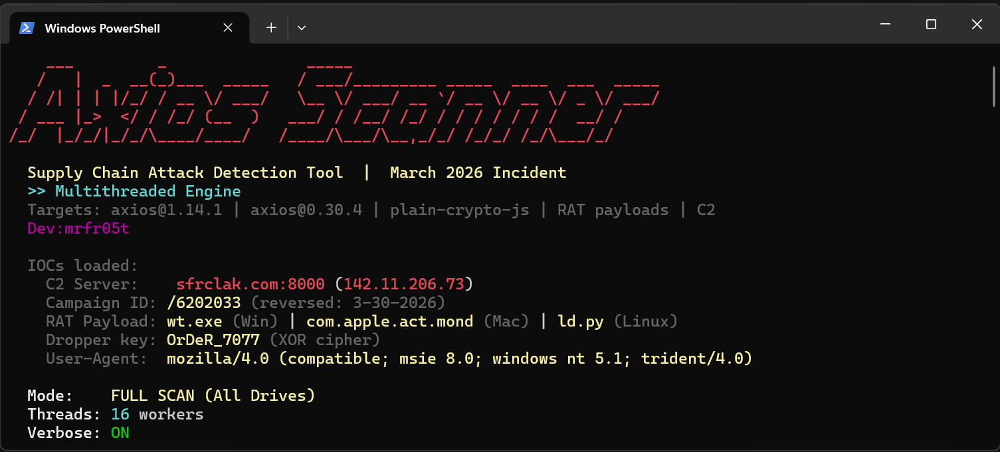

# 🛡️ Axios Malware Scanner

[](https://opensource.org/licenses/Apache-2.0)
[](https://www.python.org/)

*Coded by MrFrost*

## 📸 Overview


A blazing-fast, multi-threaded incident response tool built specifically to detect and hunt the **March 2026 Supply Chain Attack** involving compromised versions of `axios` (v1.14.1, v0.30.4) and the malicious `plain-crypto-js` RAT dropper.

---

## ⚡ Features

- **Multi-Threaded Engine:** Uses a concurrent thread pool to scan vast file systems efficiently. Tests show it is capable of parsing 450,000+ directories in under 30 seconds.
- **Deep Drive Traversal:** Uses the native Win32 API to automatically discover all mounted logical drives and recursively crawls every folder in parallel.
- **Real-Time Display:** Visually tracks the specific drives being scanned (e.g., `[C:, D:, E:]`), files hit, and directories probed.
- **Four-Phase Threat Hunting:**
  1. **Package & Dependency Scan:** Hunts all `package.json` and lockfiles for references or installations of `axios@1.14.1`, `axios@0.30.4`, and `plain-crypto-js`.
  2. **RAT Artifact Detection:** Hunts for the specific cross-platform payloads dropped by the malware during its `postinstall` hook (`wt.exe` on Windows, `com.apple.act.mond` on Mac, `ld.py` on Linux).
  3. **Active C2 Network Scan:** Checks DNS caches, parses local active network sockets, and flags any live connections routing to the known infrastructure (`sfrclak.com:8000`).
  4. **Host Remediation Verification:** Verifies the integrity of your local OS `hosts` file to ensure the malicious domains are actively dropping traffic.

## 🛠️ Installation

Simply clone this repository and ensure you are using Python 3.8 or higher. No external Python dependencies required!

```bash
git clone https://github.com/MrFrost/axios-malware-scanner.git
cd axios-malware-scanner
```

## 🚀 Usage

**1. Full System Scan (Default & Recommended)**  
Run the tool without any arguments to trigger a full system deep-scan across **all** available internal and external drives:
```bash
python axios_malware_scanner.py
```

**2. Quick Scan (Home Profile)**  
Only checks your user's home directory and common dev environments (e.g. `C:\Users\YourName` and global NPM caches). Useful for rapid spot-checking.
```bash
python axios_malware_scanner.py --quick
```

**3. Custom Target Path**  
Target the scanner specifically at a single server volume or project directory.
```bash
python axios_malware_scanner.py --path C:\Users\YourName\Desktop\MyProject
```

## ⚠️ Output & Remediation
If the scanner detects a compromised package or active RAT, it will output a severe **CRITICAL** warning, log the exact file path or process ID, and provide immediate incident response remediation steps (killing the active processes, wiping the artifact, and purging npm caches).

**Example Output of Clean System:**
```text
  No compromised packages, RAT artifacts, or C2 connections found.
      / OK  \
     |   +   |
      \_____/
```

## 🔒 IOCs (Indicators of Compromise) Tracked
- **Malicious Packages:** `axios@1.14.1`, `axios@0.30.4`, `plain-crypto-js`
- **C2 Domains:** `sfrclak.com`
- **C2 Network Flow:** IP `142.11.206.73`, Port `8000`
- **Campaign Paths:** `/6202033`
- **Dropper Signatures:** `OrDeR_7077`, heavily obfuscated `Node.js` cross-platform spawn behavior.

## 📄 License
This open-source project is licensed under the **Apache License 2.0**. See the `LICENSE` file for more details.
